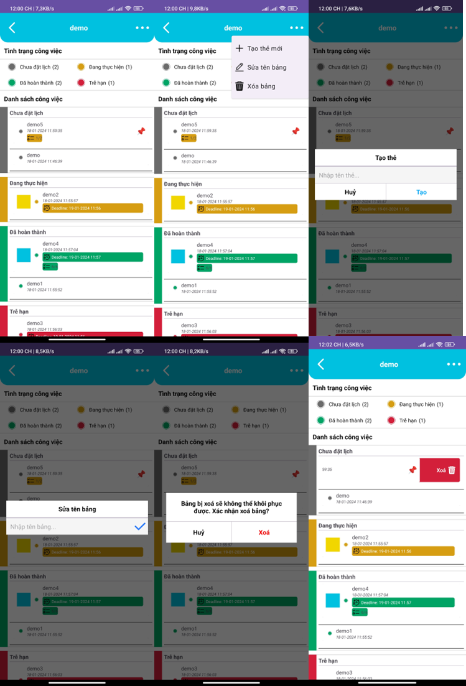
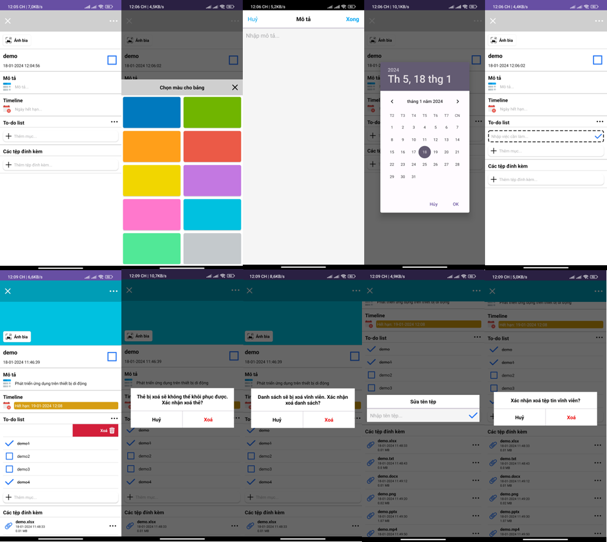

# ✅ teamV - A personal task management app 📒

**teamV** is a comprehensive Android application designed to streamline personal task management. This project, developed as part of a course on Mobile Applications Development, offers a user-friendly interface and robust functionality for organizing and tracking your tasks and notes.

## 🛈 About

**teamV** helps users manage their personal tasks efficiently with features for note-taking, deadline management, to-do lists, and file attachments. The app leverages Firebase for backend services, providing a seamless and reliable user experience.

    </img>

## ✨ Core features

1. **Note-taking:** Create and manage notes with text and file attachments.
2. **Deadlines:** Set and track deadlines for tasks.
3. **To-do lists:** Organize tasks into lists.
4. **File attachments:** Attach and manage files related to tasks and notes.
5. **Calendar management:** View and manage tasks on a calendar. Track and view tasks by day, month, or year.
6. **Profile settings**: Manage profile information.

## 🤖 TechStack

- **Java:** For app development.
- **Android Studio:** IDE for building the app.
- **Firebase:**
  - **Authentication:** User sign-in and sign-up.
  - **Firestore:** Cloud database for data storage.
  - **Storage:** For file management.

## 💡 Diagrams

- Use-case diagram:

    </img>

- Class diagram:

    </img>

- Function diagram:

    </img>

- Database diagram:

    </img>

- Cloud storage design:

    </img>

## 📱 Screens

- Welcome screen:

    </img>

- Register screens:

    </img>

- Login screens:

    </img>

- Board screens:

    </img>

- Status list screens:

    </img>

- Card screens:

    </img>

- Calendar screens:

    </img>

## 📥 Demo

👉 You can click [here](https://youtu.be/Qxm42U8p8-0?feature=shared) to watch the demo.

    </img>

**Enjoy!!!**